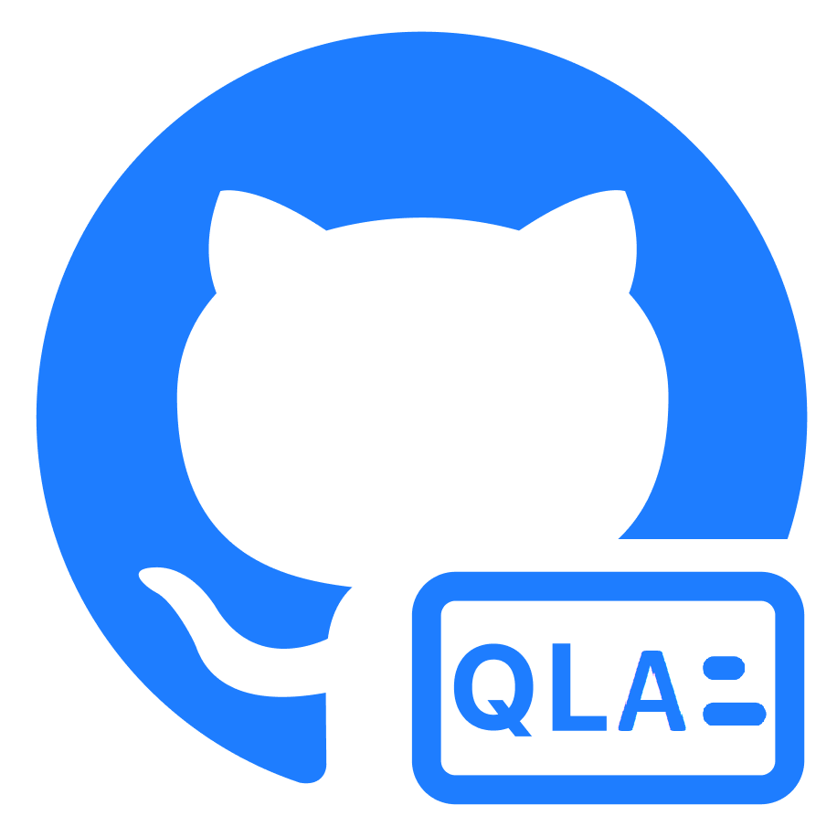

<h1 align="center"> CodeQL Agent </h1>

<div align="center">


[](https://marketplace.visualstudio.com/items?itemName=DoubleVKay.codeql-agent)
[](https://marketplace.visualstudio.com/items?itemName=DoubleVKay.codeql-agent)
[](https://raw.githubusercontent.com/IBM-Bluemix/vscode-log-output-colorizer/master/LICENSE)
[](https://vsmarketplacebadge.apphb.com/rating-star/DoubleVKay.codeql-agent.svg)

*An extension for Visual Studio Code that simplifies the usage of CodeQL*


</div>

> This project is an extension for Visual Studio Code that simplifies the usage of CodeQL and helps execute code scanning automatically.

### Contents:
  - [Features](features)
  - [Requiremennts](#requirements)
  - [Installation](#installation)
  - [Getting started](#getting-started)
  - [Usage](#usage)
    - [Execute CodeQL code scanning](#execute-codeql-code-scanning)
    - [Automize creating CodeQL database](#automize-creating-codeql-database)
    - [Integrate CodeQL into GitLab CI/CD](#integrate-codeql-into-gitlab-cicd)
  - [Configuration](#configuration)
  - [Support](#support)
  - [Contributing](#contributing)
  - [Contributors](#contributors)
  - [Release notes](#release-notes)
  - [License](#license)

## Features

Here are some of the features that CodeQL Agent provides:

- Execute CodeQL code scanning.
- Automize creating CodeQL database.
- Integrate CodeQL into GitLab CI/CD 

## Requirements

CodeQL Agent based on [Docker](https://www.docker.com/). Executing CodeQL Agent requires **root** privilege (open Visual Studio Code with root) or **Docker Management** privilege (see [Manage Docker as a non-root user](https://docs.docker.com/engine/install/linux-postinstall/#manage-docker-as-a-non-root-user) for more information).

Please install [SARIF Viewer](https://marketplace.visualstudio.com/items?itemName=MS-SarifVSCode.sarif-viewer) to view SARIF results better. 

You also can install [Output Colorizer](https://marketplace.visualstudio.com/items?itemName=IBM.output-colorizer) to colorize the output log. 

## Installation

In Visual Studio Code, you can install CodeQL Agent on **Extensions View** (Ctrl + Shift + X) or you can download it from [Visual Studio Code Marketplace](https://marketplace.visualstudio.com/items?itemName=DoubleVKay.codeql-agent)

Before running CodeQL Agent, please make sure that you are checked [Requirements](#Requirements) before running the CodeQL Agent.

## Getting started


1. Open your source code in Visual Studio Code.
2. Click the **Scan** button on the extension view panel.
3. CodeQL Agent execute code scanning automatically. It will take some time for the first run
4. The results of code scanning will display on the **SARIF Viewer panel**.


## Usage

### Execute CodeQL code scanning

 Click the **Scan** button to execute code scanning at your current folder. You also can choose other source code to scan by click the **Scan folder** button.

The results of code scanning are stored at `codeql-agent-results` folder. It includes:
- `codeql-db` folder: the codeql database built from the source code
- `gl-sast-report.json`: the result Gitlab SAST Security Report Schemas file format.
- `issues.sarif`: the result SARIF file format. 

After code scanning completes, The SARIF Viewer Panel will show up automaticlly if it's already pre-installed. Otherwise, please install [SARIF Viewer]() then click to the `issues.sarif` file to view the results. 

### Automize creating CodeQL database

### Integrate CodeQL into GitLab CI/CD


You can integrate CodeQL into Gitlab CI/CD by setting up the `.gitlab-ci-cd.yml` file with the following template:

```yaml
codeql:
  image: doublevkay/codeql-agent-dev:latest
  script: /root/scripts/analyze.sh
  artifacts:
    reports:
      sast: gl-sast-report.json
```

*For more information and customization, please check out [CodeQL Agent for Docker](https://github.com/vovikhangcdv/codeql-agent).*
 

## Configuration

Click **Settings** button to move on to extensions setting panel. This extension supports the following settings:

| Option  | Description |
| ------- | ----------- |
`cli.dockerExecutablePath` | Set path to the Docker executable that should be used by the CodeQL extension. If empty, the extension will look for a Docker executable on your shell PATH, or if Docker is not on your PATH, download and manage its own Docker executable.
`project.outputPath` | Set path to the output folder. Please enter full path. Default is *`${currentProjectPath}/codeql-agent-results`*
`project.overwriteFlag` | Enable/disable overwrite database when database path is exists and not an empty directory. This flag is useful for forcely rebuild database.
`project.language` | Set project language to buidling database or execute SAST.
`project.threads` | Use this many threads to build database and evaluate queries. Defaults to 1. You can pass 0 to use one thread per core on the machine.
`project.saveCache` | Aggressively save intermediate results to the disk cache. This may speed up subsequent queries if they are similar. Be aware that using this option will greatly increase disk usage and initial evaluation time.


## Support

You can open an issue on the [GitHub repo](https://github.com/vovikhangcdv/codeql-agent-extension)

## Contributing

Contributions are always welcome! Just simply create merge request or contact me  <a href="https://twitter.com/doublevkay">
      </a>

## Contributors
<a href="https://github.com/vovikhangcdv/codeql-agent-extension/graphs/contributors">
  
</a>

## Release Notes

[See details](https://github.com/vovikhangcdv/codeql-agent-extension/releases)

## License

CodeQL Agent is licensed under the [MIT license](https://github.com/vovikhangcdv/codeql-agent-extension/blob/main/LICENSE).
